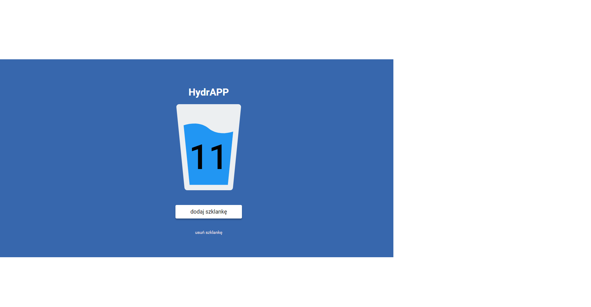

# HydrAPP

Zapraszam na moją stronę: [HydrAPP](https://mariuszrukowicz.github.io/hydrAPP/)

## Jak uruchomić stronę lokalnie

 Aby uruchomić moją strone lokalnie wykonaj poniższe polecenia:
 
 `npm install -g gulp-cli`
 
 `npm install`
 
 `gulp`
 
